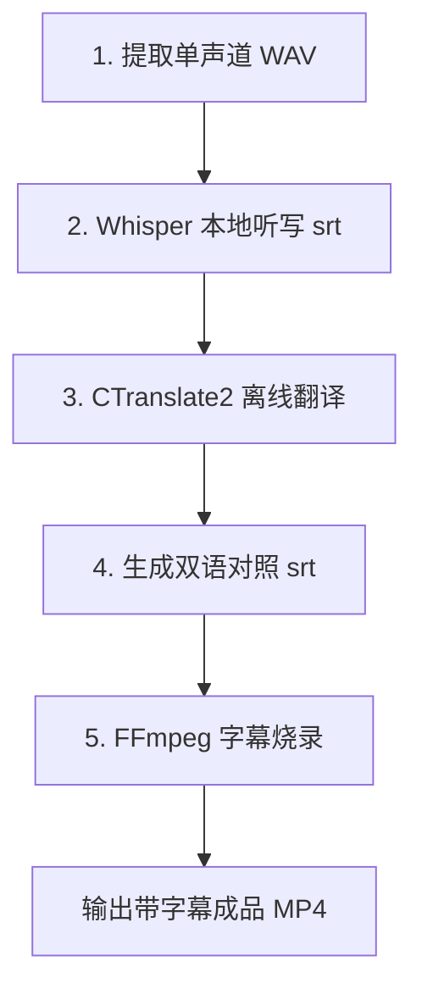

# 本地双语字幕识别与压制实现方案 (Subtitle Workflow Guide)

本文档详细记录了本项目如何通过本地 Python 环境、**faster-whisper** 语音识别引擎、**CTranslate2 (免 PyTorch) 翻译引擎**以及 **FFmpeg** 压制工具，完整实现“视频下载 ➡️ 语音听写 ➡️ 本地离线翻译 ➡️ 视频双语字幕压制”的完整闭环方案。

本方案针对 **2GB 内存的轻量 VPS** 进行了深度内存与性能优化。

---

## 🔄 核心架构设计



---

## 🛠️ 第一部分：系统环境与依赖安装

要运行本方案，本地系统/VPS 必须安装以下依赖：

1.  **FFmpeg 安装**：已安装并加入系统环境变量 `PATH`。用于音频重采样提取以及最终的字幕烧录压制。
2.  **Python 3.12 运行环境**。
3.  **核心依赖包安装**（无 PyTorch 依赖，极省磁盘与内存）：
    ```bash
    pip install faster-whisper ctranslate2 sentencepiece yt-dlp -i https://pypi.tuna.tsinghua.edu.cn/simple
    ```

---

## 💾 第二部分：2GB VPS 内存优化配置

如果物理内存只有 2GB，必须进行以下两项系统层面的优化配置，防止 OOM 崩溃：

### 1. 启用 Swap 虚拟内存 (Linux)
在 VPS 上执行以下指令启用 2GB 虚拟内存：
```bash
# 创建 2GB 交换文件
sudo fallocate -l 2G /swapfile
sudo chmod 600 /swapfile
sudo mkswap /swapfile
sudo swapon /swapfile
# 永久生效：追加 "/swapfile swap swap defaults 0 0" 到 /etc/fstab
echo '/swapfile swap swap defaults 0 0' | sudo tee -a /etc/fstab
```

### 2. 限制推理线程数
在代码中显式限制 CPU 线程为 1 或 2，防止 VPS 的 CPU 被瞬时占满导致 ssh 掉线：
```python
# 限制线程数为 1 核心
model = WhisperModel("base", device="cpu", compute_type="int8", cpu_threads=1)
translator = ctranslate2.Translator("models/opus-mt-ja-zh", device="cpu", inter_threads=1, intra_threads=1)
```

---

## 📝 第三部分：完整代码实现步骤

### 🚀 步骤一：音频处理 (16kHz 单声道)
Whisper 引擎处理 16kHz Mono 的 WAV 音频准确率最高。我们通过 `ffmpeg` 将视频音轨提取并转换：
```python
import subprocess
# 提取单声道 wav
subprocess.run([
    "ffmpeg", "-y", "-i", "input_video.mp4",
    "-vn", "-ar", "16000", "-ac", "1",
    "-c:a", "pcm_s16le", "temp_audio.wav"
], stdout=subprocess.DEVNULL, stderr=subprocess.DEVNULL)
```

### 🚀 步骤二：本地语音听写 (faster-whisper)
加载 Whisper 模型进行音频听写，保存原始字幕并获取源语言（如日语 `ja` 或英语 `en`）：
```python
from faster_whisper import WhisperModel

model = WhisperModel("base", device="cpu", compute_type="int8", cpu_threads=1)
segments, info = model.transcribe("temp_audio.wav", beam_size=5, vad_filter=True)

# 打印检测到的语言
source_lang = info.language # 例如 'ja'
```

### 🚀 步骤三：本地离线翻译 (CTranslate2 + SentencePiece)
使用赫尔辛基大学开源的 `Opus-MT` 翻译模型，直接通过 C++ 推理引擎 `ctranslate2` 进行翻译。
*   **模型体积**：每个语种转换后仅有 **120MB** 左右。
*   **下载与转换**（在本地电脑完成转换，再打包上传至 VPS 可完全免去 PyTorch）：
    ```python
    import ctranslate2
    import sentencepiece as spm

    # 1. 载入本地翻译模型 (免 PyTorch)
    model_path = f"models/opus-mt-{source_lang}-zh"
    translator = ctranslate2.Translator(model_path, device="cpu")

    # 2. 载入分词器 (SentencePiece)
    sp_source = spm.SentencePieceProcessor()
    sp_source.load(f"{model_path}/source.spm")
    sp_target = spm.SentencePieceProcessor()
    sp_target.load(f"{model_path}/target.spm")

    # 3. 翻译函数
    def translate_text(text):
        tokens = sp_source.encode(text, out_type=str)
        results = translator.translate_batch([tokens])
        translated_tokens = results[0].hypotheses[0]
        return sp_target.decode(translated_tokens)
    ```

### 🚀 步骤四：生成双语对照 SRT 字幕
将 Whisper 提取出的句段文本进行翻译，并拼接成上下对照的双语字幕格式写入 `.srt` 文件中：
```text
1
00:00:00,000 --> 00:00:02,000
お金というのは生き物なのです。
金钱其实是有生命的东西。
```

### 🚀 步骤五：FFmpeg 视频硬字幕烧录
最终，使用本机 `ffmpeg` 将生成的双语 `bilingual.srt` 压制进视频中，输出可以直接在手机相册、微信流畅播放的成品视频：
```bash
ffmpeg -y -i input_video.mp4 -vf "subtitles=bilingual.srt:force_style='FontSize=16,PrimaryColour=&HFFFFFF,OutlineColour=&H000000'" output_subtitled.mp4
```
*   `force_style`：设置字幕参数，包括字体大小 `FontSize=16`，白色主色 `HFFFFFF`，黑色外描边 `H000000`，保证各种背景下字幕均清晰可见。
